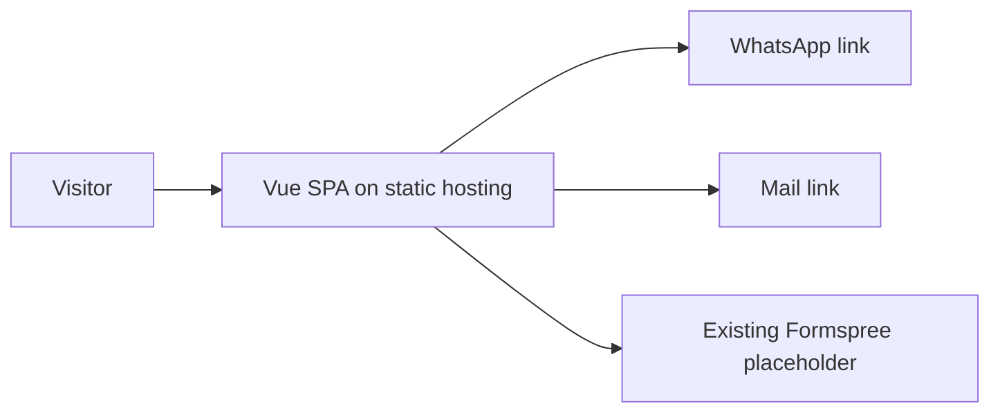
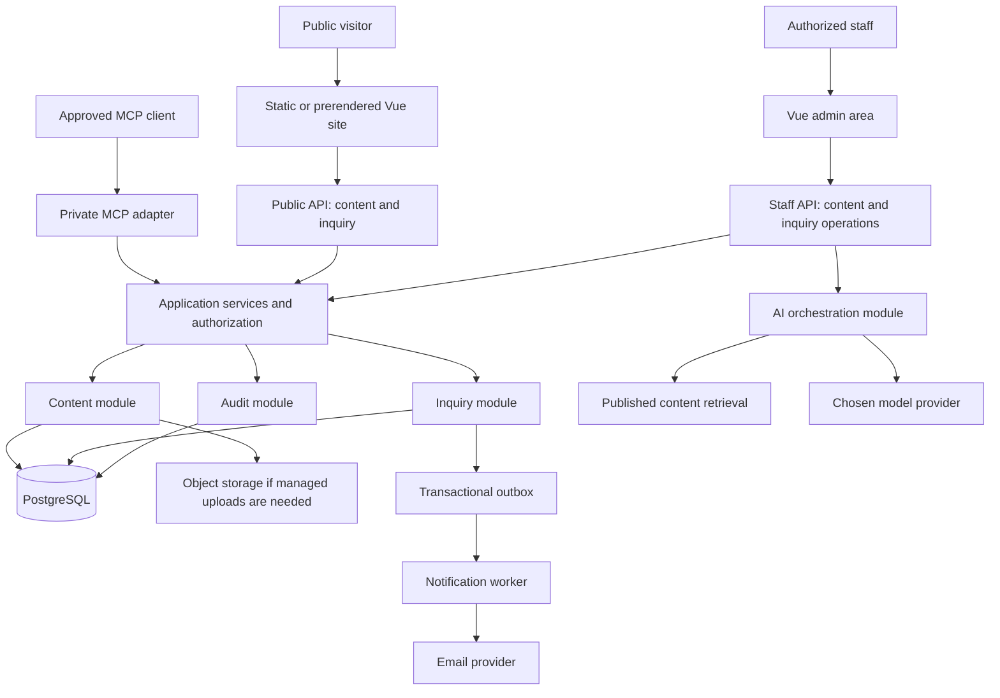

# 404HubSpot system architecture

Version 1 · 2026-09-30 · Target architecture; only frontend feature 01 is implemented.
Business: present credible digital services/work, enroll learning inquiries, receive qualified
project leads, and give staff safe tooling to maintain content and follow up.

## Decisions

Keep the existing Vue/Vite app and route URLs. Evolve toward a modular monolith with one
backend API, one relational database, and adapters for notifications, AI and MCP. Deploy
only when the owning feature is ready. AI is optional at runtime; MCP is an explicit planned
capability. A mobile-development service page does not justify a native app for this business.
No Kubernetes, service mesh, event broker, multi-tenant SaaS, billing, or payment collection
is needed for a company portfolio. Selling M-Pesa integration is not processing payments here.

## Current system

No application backend, accounts, CMS, database, AI, or MCP server currently exists.
Vercel/Netlify configurations exist; a live deployment has not been verified.

## Target system — staged, not deployed

The drawing shows logical boundaries, not a requirement for a separate service per box.
MCP starts as an adapter sharing domain services, never direct unrestricted database access.
A worker can use the same codebase and managed runtime; split execution only for retries or
latency isolation. Anonymous AI chat, if justified, uses a separate limited endpoint; it cannot
invoke staff tools or inspect inquiry records.

## Deployment and source shape

Now: existing `src/`, `public/`, package files; documentation-only layer kits.
When feature 17 starts, introduce `backend/` with its own manifest and owner instructions,
without moving frontend source. Proposed backend: Node.js LTS + TypeScript + Fastify and
PostgreSQL. Verify supported versions, hosting and maintenance fit in that spec before pinning.
`backend/src/modules/{content,inquiries,identity,audit}` owns domain logic;
`backend/src/adapters/{http,mcp,mail,ai}` translates protocols. Schema/DTO contracts are
versioned in docs/contracts plus generated schemas when the backend exists.
AI and MCP have separate logical ownership kits without duplicating backend business rules.
`infra/` runtime files arrive only with concrete deployment specs; no empty services now.

## Trust and permissions

Anonymous users read published content and submit validated inquiries. Staff authenticate with
a managed OIDC provider and secure server sessions. Roles: editor (draft content), publisher
(publish/archive), inquiry operator (read/update assigned leads), administrator (membership).
Single-company access control initially; do not claim tenant isolation or build unused tenants.
Backend checks each operation; client UI is not authorization. Audit sensitive reads and writes
without storing inquiry text, tokens or model prompts in routine logs.
MCP client access is distinct from browser sessions; audience/scopes and per-tool checks apply.
AI output is untrusted proposed text. Publication, lead updates and outbound messages require
explicit preview/approval through normal domain operations.

## Data and failure paths

A successful inquiry response means a durable record exists, not that email delivery succeeded.
Persist inquiry + notification outbox atomically; retry delivery independently with deduplication.
Content public reads expose published revisions only. On API outage, static content and direct
WhatsApp/email remain available; never show an inquiry success when persistence failed.
AI timeout/limit returns a useful handoff; the site and staff console continue working.
MCP failure cannot bypass authorization or retry a write without an idempotency guarantee.

## Sequence and ownership

[Roadmap](../planning/IMPLEMENTATION-ROADMAP.md) owns order; [layer map](LAYER-MAP.md)
owns responsibility; [data model](DATA-MODEL.md) owns proposed entities;
[contracts](../contracts/FUTURE-PLATFORM.md) owns API/tool draft semantics;
[scaling triggers](SCALING-PATH.md) owns decisions to add infrastructure.
